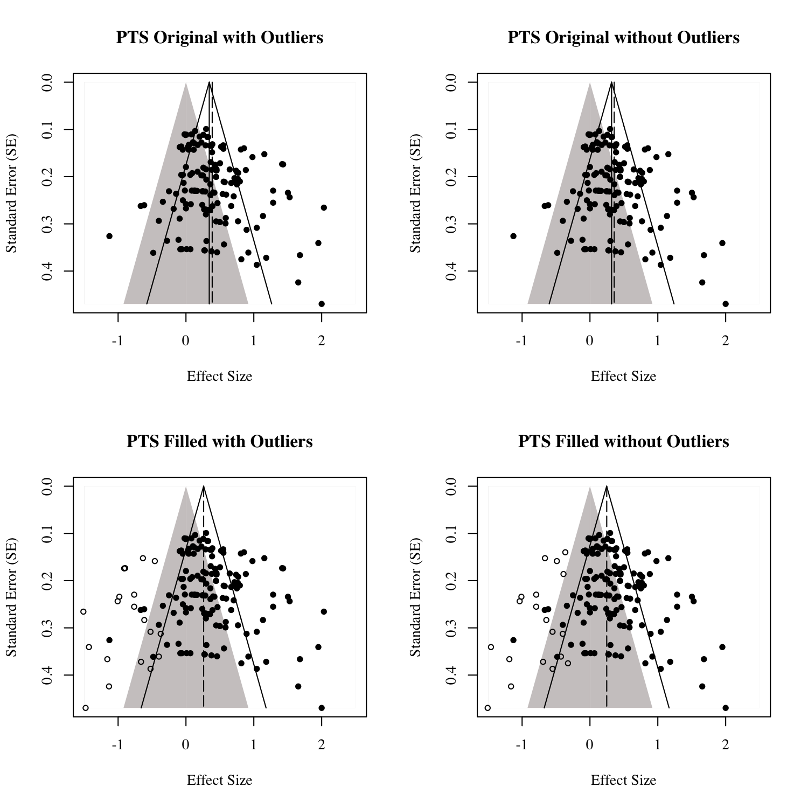
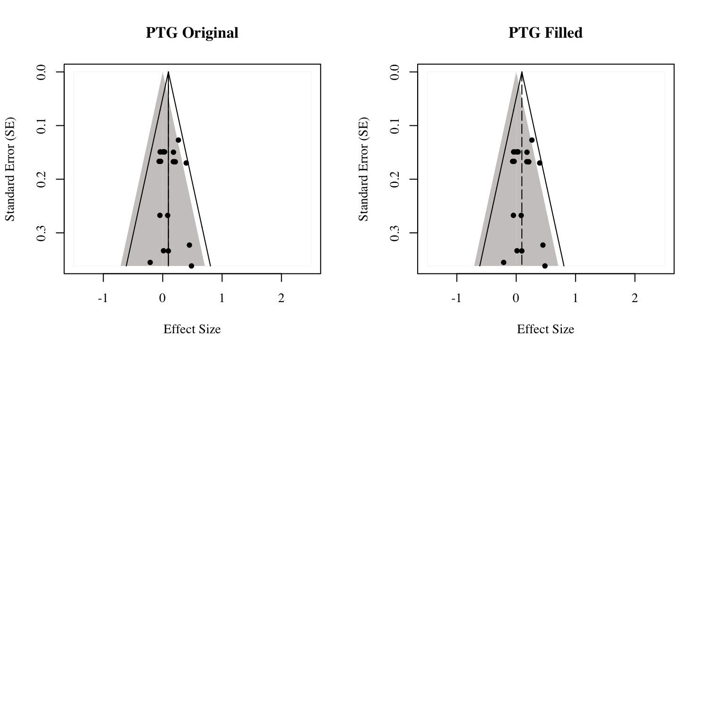
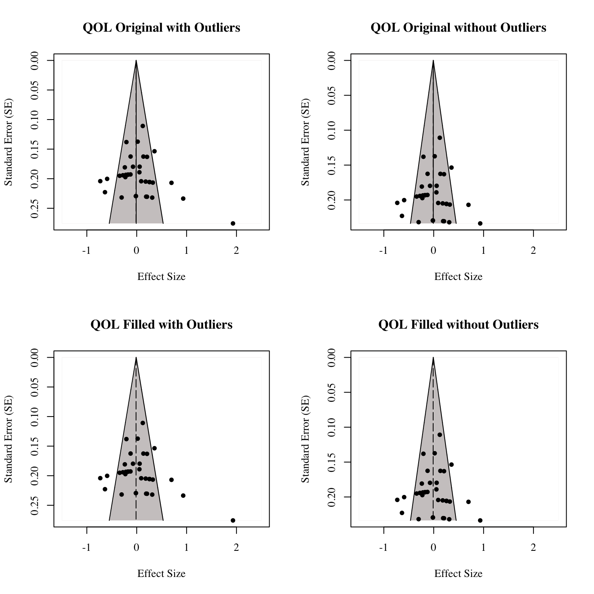

```{r libraries, include = FALSE}
library("papaja")
library(cowplot)
library(ggplot2)

cleanup = theme(panel.grid.major = element_blank(), 
                panel.grid.minor = element_blank(), 
                panel.background = element_blank(), 
                axis.line.x = element_line(color = "black"),
                axis.line.y = element_line(color = "black"),
                legend.key = element_rect(fill = "white"),
                text = element_text(size = 12),
                axis.text.x = element_text(size = 10),
                axis.text.y = element_text(size = 10))

fplot = function(d, xlab = "d avg", ylab = "Study"){
  require(ggplot2)
  p = ggplot(data=d, aes(d$plotname, d$effect.size)) +
    geom_pointrange(aes(x=d$plotname, y=d$effect.size, 
                        ymin=d$lowd, ymax=d$highd),
                        shape = 18, size = d$weight) +
    geom_hline(yintercept = 0, lty = 1) +
    geom_hline(yintercept = mean(d$lowd), lty = 2) +
    geom_hline(yintercept = mean(d$highd), lty = 2) +
    coord_flip() +
    ylab(xlab) +
    xlab(ylab) +
    cleanup
  return(p)
}

#devtools::install_github("RobbievanAert/puniform")
#Joe-Hilgard/PETPEESE
library(puniform)
library(weightr)
source("petpeese.R")

```

## Emotional Expression 

Emotional expression relating to negative emotions or trauma has been shown to enhance both mental and physical health outcomes [@Rachman1980; @Scheff1979; @Esterling1990; @Fawzy1993; @Lieberman2006]. For example, the disclosure of traumatic or stressful events has been shown to reduce stress and lead to positive health outcomes in those with diabetes [@Bodor2002] and breast cancer [@Stanton2002], among others. Inhibiting repressive thoughts or emotions, rather, may be detrimental to both physical and psychological health [@Gross1997; @Goldstein1988; @Larson1990a]. While some studies suggest that emotional expression in the form of 'truth telling' may cause psychological harm to individuals [@Brouneus2010], the literature presents a plethora of evidence confirming the negative effects of a lack of emotional expression, such as social concerns, overall psychological dysfunction, and lack of value-congruent behaviors [@Frankl1959; @Pennebaker1989; @Pennebaker1986; @Schulenberg2008; @Wilson2009]. These resulting negative outcomes may lead to detrimental effects on health [@Pennebaker1986]. Individuals having experienced a traumatic or stressful life event are significantly more likely to repress thoughts and feelings about their experience compared to individuals who have not experienced such events, thereby subjecting them to potential negative outcomes caused by a lack of emotional expression [@Bodor2002]. 

## Expressive Writing as Effective Emotional Expression

@Pennebaker1986 first showed that emotional expression can be both experimentally manipulated and have positive benefits to participants. In their seminal study, they randomly assigned participants to several writing groups, including writing about a "stressful or traumatic" life event or a neutral event. As such, the content of the writing likely varies widely based on the contextual factors (e.g. topic, setting, sample, health concern). The group that disclosed both regarding their trauma and the emotions surrounding said trauma later showed a reduction in health visits. Pennebaker has replicated the use of expressive writing across a number of studies ranging from improved health [@Pennebaker1988; @Pennebaker1990] to improvements in school [@Pennebaker1996] and work [@Francis1992]. Others have expanded this work to show positive effects on mood [@Schoutrop2002] and asthma [@Smyth1999]; however, several controlled studies have shown to not replicate [@Harris2005] or null effects [@Gidron1996a; @Walker1999a]. This protocol, more generally, has been termed written emotional disclosure (WED).

The idea that a brief, controlled writing task can have numerous positive health and psychological benefits can certainly be controversial, given the existing literature. For example, @Henry2010 found that expressive writing only benefited a rural population for those individuals surviving breast cancer on physical and psychological health outcomes, while @Lancaster2015 found no significant evidence that expressive writing can be considered an effective approach in measuring posttraumatic growth. Additionally and as mentioned, @Brouneus2010 found that 'truth telling' caused harm to individuals in a forensic setting. Regardless, the concept remains interesting due to the nature and inexpensive implementation of expressive writing. Many individuals who have experienced traumatic events do not wish to disclose their feelings regarding the events with others. Additionally, those who do not meet diagnostic criteria (e.g. subclinical symptoms) are sometimes neglected despite probable suffering [@Wilson2009]. However, by utilizing expressive writing as a personal method of treatment, individuals are able to effectively express their emotions while avoiding talking to another individual or clinician about the traumatic event [@Smyth1998]. @Pennebaker1993 found that experimental conditions assigned to participate in an expressive writing task generally report more positive changes than those in control conditions. Some controversy has been observed over whether or not writing about a formerly disclosed event is more effective than writing about an undisclosed event. @Greenberg1992 conducted an experiment where they separated participants into three groups: writing about a formerly disclosed trauma, writing about an undisclosed trauma, and a control group. They found no difference between groups in efficacy. However, they did find that those who disclosed more severe traumas reportedly experienced fewer physical symptoms at follow up, which suggests that the type of trauma revealed can play a significant impact on symptom reduction and physical health. A review of current meta-analyses relative to expressive writing is presented in a subsequent section. 

## Possible Mechanisms Underlying Expressive Writing Efficacy

In order to understand why expressive writing is considered to be efficacious, one must examine the cognitive, social, and behavioral processes by which it promotes information processing. @Pennebaker1990 discovered that individuals who benefited from expressive writing attributed their success from the writing task to a renewed sense of understanding. Further, @Pennebaker1993 conducted a textual analysis on expressive writing content and found that those who were more successful during the task used causation words. Pennebaker thus concluded that expressive writing was a way for individuals to effectively process the event cognitively, which may explain the aforementioned renewed sense of understanding and excess of causation-oriented words. Aside from theories related to cognitive-processing and inhibition, there are a number of other theories related to emotional disclosure that warrant mentioning. The first is the social integration model [@Pennebaker2001]. This model suggests emotional disclosure can have a positive impact on how people interact in their environment. This increased environmental interaction has been shown to have positive benefits on health [@Frattaroli2006]. Second, expressive writing parallels exposure therapy for  phobias and Posttraumatic Stress Disorder (PTSD), which suggests that repeatedly exposing oneself to the fear or trauma can reduce the negative emotions or physical sensations associated with that fear or trauma [@Meshberg-Cohen2014]. Given that exposure therapy has been shown to be effective for reducing symptoms of posttraumatic stress [PTS; @Sloan2005], one would expect individuals in these studies to experience a reduction in PTS symptoms after taking part in an expressive writing task. Third, @Wilson2009 discussed how the nonjudgmental acceptance of emotions leads to positive health benefits by promoting value-congruent behavior, one of the main facets of Functional Contextualism theory and Logotherapy [@Frankl1959; @Schulenberg2008]. Indeed, emotional expression in the form of expressive writing could be considered a form of nonjudgmental acceptance, although it may not necessarily lead to behavior change in all cases. Finally, a recently proposed theory that may help explain positive outcomes is referred to as a distance percpetive [@Kross2011]. This theory posits that, when individuals adopt a psychologically distanced perspective, they are better able to better understand their life situation. In sum, it seems likely that there are multiple underlying mechanisms that account for the beneficial outcomes associated with expressive writing described below. Indeed, the wide range of theroetical perspectives provide further evidence which suggests that expressive writing is applicable in a variety of contexts. Previously conducted meta-analyses, however, present varying results. 

## Meta-Analytic Techniques

Meta-analyses allow researchers the opportunity to collectively examine the efficacy of different psychological interventions/tasks on outcome variables [@Glass1976; @Borenstein2007; @Hedges1982]. Although many studies produced positive outcomes associated with expressive writing, some of these studies tend to neglect important questions, the most important of which is whether or not the effect sizes are meaningful [@Smyth1998]. Meta-analyses are a technique that allows researchers to pool studies to examine an overall, weighted, population effect [@Borenstein2007]. Several meta-analyses of expressive writing and emotional expression have been explored that warrant explanation: @Smyth1998, @Frisina2004a, @Frattaroli2006, @Reinhold2018, @VanEmmerik2013 and @Mogk2006. These meta-analyses have laid a foundation for exploring the effects of writing on psychological outcomes. 

@Smyth1998 conducted the seminal meta-analysis regarding the efficacy of expressive writing. They included studies utilizing an expressive writing group and control group (neutral topic). This particular analysis examined the efficacy of expressive writing on psychological well-being, general health, and physical functioning. In sum, 13 studies/effect sizes were included, and the authors found an overall medium effect size, *d* = 0.47, for the experimental group compared to the control group. A later meta-analysis conducted by @Frisina2004a expanded these analyses. They included studies utilizing clinical samples and employing the paradigm adapted by @Pennebaker1986. This meta-analysis included 9 studies in total and found an effect size of *d* = .19 for health-related outcomes and *d* = .07 for psychological outcomes. The next expressive writing meta-analysis was conducted by @Mogk2006 and aimed to update the state of the literature on expressive writing. Similar to previously-conducted analysis, they included studies employing Pennebaker's paradigm on experimental and control groups. Additionally, they only included studies with a 4-week follow up that included at least 10 participants. In sum, 30 studies met their criteria. They found nonsignificant effects on somatic and psychological health outcomes and concluded that expressive wrting does not promote health-related outcomes. These findings corroboate those from @Frisina2004a. @Frattaroli2006 conducted perhaps the most notable meta-analysis to data examining the efficacy of emotional disclosure on the folliwing constructs using only randomized and control conditions: psychological health, physiological functioning, reported health, health behaviors, and general functioning/life outcomes. Additionally, their meta-analysis was the first to employ random effects models, which estimate the mean of a proposed distribution of population effect sizes. Prior meta-analysis employed fixed effects models, which assume that all studies assess the same "true" population effect size, which may be an untenable assumption across different assessment and populations [@Borenstein2007]. They included a wide range of studies, *N* = 146. Individual studies were again collapsed into one publication effect size, although these effects were also examined separately by health outcome. Overall, @Frattaroli2006 found a weighted *r* effect size of .08 for all outcomes combined, which would be considered small. Additionally, they examined potential moderators and found larger effect sizes for the following samples: those with physical health problems, those with a history of having experienced traumatic or stressful events, samples not including college students, samples where expressive writing tasks were conducted at home and in private settings, paid participants, more male participants, and fewer participants [see @Frattaroli2006 for a complete list of moderators]. A recent analysis conducted by @VanEmmerik2013 employing Pennebaker's paradigm found included 6 eligible studies that compared treatment to control groups. In regards to inclusion criteria, they included studies where participants had a diagnosis of Acute Stress Disorder (ASD) or PTSD. They found that those who participated in the expressive writing group experienced short-term reductions in PTS and comorbid depressive symptoms, combined Hedges' *g* = .81. The most recently published meta-analysis was conducted by @Reinhold2018 and examined the effects of expressive writing on depression by randomizing participants to conditions (expressive writing vs. control). They included 39 randomized controlled trials and excluded individuals with diagnoses of PTSD. This study did not support utilizing expressive writing for depression outcome measures for the specified sample. Further, they found that expressive writing did not yield any type of long-term effect on depression outcomes.

## Posttraumatic Stress

Posttraumatic Stress Disorder (PTSD) is a disorder involving re-experiencing thoughts or experiences after a traumatic event or experience. This generates a context where individuals are prone to affect-related deficiencies and maladaptive behaviors [@AmericanPsychiatricAssociation2013]. DSM-5 criteria are based on 20 symptoms structured into four different subsets in those having experienced a traumatic event. These subsets are as follows: re-experiencing, avoidance, negative alterations in cognition and mood, and increased arousal [@Crespo2016]. While the renewed DSM-5 criteria are now increasingly employed, the current meta-analysis considers studies using DSM-IV criteria. DSM-IV criteria are similar and include the following: exposure to a traumatic event, re-experiencing (intrusion), avoidance, and increased arousal [@AmericanPsychiatricAssociation2013]. Further, the studies employed in the current meta-analysis are divided according to these subsets (arousal, intrusion, and avoidance). PTSD affects a wide variety of groups, a few of which are sexual assault survivors [@Klump2008], Iraq and Afghanistan war veterans [@Gentes2014], and those exposed to natural disasters [@Wang2000]. 

Research conducted on the efficacy of expressive writing on PTSD symptoms presents intriguing results. @Sloan2007 examined individuals with at least moderate PTSD symptom severity and found that individuals assigned to an emotional expression writing condition reported fewer PTSD and depression symptoms during follow up. @Sloan2011a found that PTSD symptoms decreased after a written emotional disclosure task, although this decrease was not significantly different than a control group change. @Blasio2015a recruited women who had just given birth and assessed them a few days after experiencing childbirth along with a three-month follow-up. Results showed that women who had participated in the expressive writing task had lower depression and posttraumatic stress symptoms than the group assigned to a neutral writing condition. Additionally, regression models showed that expressive writing was significantly linked to a reduction of PTSD symptoms across different dimensional levels of symptom severity. Only 20 of the 113 women recruited for this study qualified for a diagnosis of PTSD, but those who reported mild symptomology responded better to the task than those meeting criteria for PTSD. This limitation suggests that those with moderate distress could perhaps benefit more from an expressive writing task than those diagnosed with or meeting the qualifications for PTSD. It may also explain the differences in results in comparing to @Sloan2011a, as they found that those with a clinical diagnosis of PTSD did not respond to an emotional disclosure writing task. Perhaps it is more advantageous to examine effect sizes separately in with diagnoses of PTSD and subclinical symptoms. Further, in 2012, @Sloan2012 adapted a writing protocol to focus primarily on the emotions, meaning, and 'hot spots' associated with the trauma. They referred to this as the written exposure therapy (WET) protocol, distinguishable from the paradigm adapted by @Pennebaker1986. In their seminal study examining the effiacy of WET for motor-vehicle accident related PTSD, they found that those in the WET condition experienced significant reductions in PTSD symptoms throughout the course of the study. Since then, a number of other studies employing the WET procedure have been employed in those with PTSD, which will be systematically examined in the current analysis.  

## Posttraumatic Growth 

While the literature mostly discusses potentially harmful outcomes to traumatic events such as emotional distress, traumatic events also provide opportunities for personal growth [@Aslam2013]. Traumatic events, either natural or human-inflicted, can lead to positive outcomes by allowing the individual to take a different perspective [@Cobb2006; @Taku2008]. The relationship between positive growth after a traumatic event and symptom reduction is unclear, as it is a complex process. Thus, it is necessary to examine how expressive writing might influence each variable separately, which is one of the key goals of this meta-analysis [@Slavin-Spenny2011]. Models receiving empirical support within the last decade suggest that traumatic events offer opportunities for both negative and positive experiences [@Tedeschi1995; @Weiss2002]. Posttraumatic Growth (PTG) is a positive experience after a traumatic event [@Aslam2013; @Yilmaz2016]. Specifically, PTG is classified as broad cognitive benefits that are seen after a traumatic experience. These benefits can be categorized into building closer relationships, examining new possibilities, appreciating life, recognizing personal strengths, and undergoing spiritual changes. [@Dursun2016; @Tedeschi2004]. 

PTG is associated with a variety of desired outcomes [@Dursun2016]. PTG has been studied in those experiencing natural disasters, war, and other harms such as sexual assault. Finally, PTG has been studied in those experiencing medical diagnoses such as different types of cancer and diseases. Although the relationship between PTG and symptom reduction is not yet fully understood, perhaps expressive writing allows the individual to fully comprehend the event. @Pennebaker2001 speculated that expressive writing allows an individual to feel more connected with his or her surroundings. Although this speculation does not directly explain positive outcomes after an expressive writing task, perhaps individuals gain a better appreciation for life after gaining a better sense of connectedness with that individual's surroundings. One might expect effect sizes to be larger for those studies requiring a diagnosis of PTSD, as such growth may not be possible in those with subclinical symptomology. 
  
## Quality of Life 

Quality of Life (QOL), according to @Theofilou2013 is an evaluation of the 'goodness' that an individual experiences, separated into domains of reactions to life events, disposition, life fulfillment, and satisfaction with life experiences. More generally, QOL refers to an individual's attitude towards the target life situation [@Costanza2007], delineated into objective and subjective components. Objectively, QOL refers to components outside of an individual and measurable by others, while subjective QOL is an individual's assessment of his or her own experiences [@Costanza2007]. The current meta-analysis will focus solely on the subjective components of QOL, as it is obtainable through questionnaires. @Pennebaker2001 suggested that expressive writing allows one to feel more connected with their surroundings. Further, they explain that expressive writing allows people to see things in a different way and better understand themselves. By understanding a traumatic or stressful event, one is said to see things differently and perhaps look at the situation with a more positive mindset. The changes that occur after expressive writing may also allow one to find meaning in the traumatic event, thereby increasing the QOL of that individual [@Frankl1959]. Higher QOL may be considered a type of PTG, which is why the current meta-analysis sought to examine the efficacy of studies utilizing expressive writing to improve QOL and PTG in the same study. 

## Current Meta-Analysis

The purpose of the current meta-analysis is to examine studies employing expressive writing procedures using Pennebaker's paradigm (WED) and the more recent WET protocol on variables relevant to the field of positive psychology (PTG and QOL) and PTS, with effect sizes separated by those having and not having a diagnosis of PTSD. Based on recently published literature regarding efficacy of expressive writing for different levels of PTSD symptoms, this is an important facet to consider [@Blasio2015a; @Reinhold2018; @Sloan2011a]. Surprisingly, no review has examined the effects of expressive writing on PTS separated by diagnosis. Additionally, no meta-analysis has been conducted that examines the efficacy of expressive writing on positive outcome variables such as PTG and QOL, in line with the field of positive psychology. The meta-analyses described sequentially above also focused on experimental versus control group effect sizes or *p*-values, rather than emphasizing change for the expressive writing group. This focus is likely because of the analyses provided in these publications, especially when using randomized controlled trial research designs. While this design is the gold standard for medicine, the current meta-analysis sought to examine the magnitude of change for participants who experienced an expressive writing task. For example, a comparison group may increase their quality of life scores by two points in a controlled study, while the experimental group increases their quality of life scores by four points; thus, creating a significant difference in change between the two groups. This information is valuable, but it does not tell the reader the magnitude of the change for the writing group, wherein four points might only be a small effect when examined within the group who received the writing task. This analysis will also focus on changes across time for groups who received the expressive writing task to determine what size of effects one might expect given a specific measurement schedule (i.e., one to three months, three months to six months, etc.), separated by protocol (e.g. WED or WET). This analysis should present researchers with a renewed examination of the efficacy of expressive writing on the aforementioned variables using newer meta-analytic techniques. Newer methods of meta-analysis, including *p*-curve [@Simonsohn2014; @Simonsohn2015], *p*-uniform [@VanAert2016], PET-PEESE [@Stanley2014], selection models [@Vevea1995], and trim and fill methods [@Carter2014] allow for better estimation of meta-analytic effect sizes. These analyses would be best performed by examining each potential effect separately, rather than averaging effects of each publication into one study effect size (a common trend in the previously mentioned meta-analysis). In addition to an estimate of overall effect sizes using updated techniques, the current meta-analysis estimates power for effects on writing groups, as research has shown a consistent underpowering of psychological studies, combined with a misunderstanding of the sample size needed for adequately powering one's work [@Bakker2016]. 

# Method

## Data Collection

Studies were collected through online databases, such as PsycINFO and Google Scholar, using the following search terms and their combinations: *Posttraumatic Growth, PTG, Quality of Life, QOL, Posttraumatic Stress, PTS, Expressive Writing, Emotional Disclosure, Written Emotional Disclosure (WED), Written Exposure Therapy (WET)*. Within these articles, the change in outcome variables (PTS, PTG, QOL) from pre- to post-test was the dependent variable of interest. Generally, groups were separated into an experimental and control group and then examined at different time points. For purposes of this meta-analysis, only participants assigned to the experimental condition were examined due to having received the expressive writing task. If a study included multiple assessment time points, then these measurements were examined sequentially (i.e., time 1 to time 2, time 2 to time 3) to determine change across time for the dependent variable.

```{r import, include = FALSE}
####import data####
meta_data = read.csv("meta_data.csv")

nstudies = as.data.frame(table(meta_data$Title))
nrow(nstudies)
nrow(meta_data)
mean(nstudies$Freq)
sd(nstudies$Freq)
min(nstudies$Freq)
max(nstudies$Freq)

table(meta_data$Variable)

##set up the plots later
meta_data$plotname = as.character(meta_data$plotname)
```

## UPDATE THIS SECTION 

220 citations focusing on PTS, PTG, and QOL were identified through the literature search and previous meta-analyses. After screening these studies, forty-five articles were retained for containing the appropriate information for this meta-analysis. A complete list of excluded articles can be found at https://osf.io/4mjqt, along with reasons why they were excluded. Generally, studies were included if they utilized the expressive writing paradigm adapted by @Pennebaker1986, included relevant numbers to compute an effect size, and included the relevant outcome variables. After having two reviewers independently code articles, 202 effect sizes were calculated from the forty-five studies. On average, each study represented *M* = 4.49 (*SD* = 3.50) effects, ranging from 1 to 16 effects. 144 effects were calculated for PTS, 21 for PTG, and 37 for QOL. 

## Calculations for Effect Size, Variance, and Confidence Intervals

For our purposes, we used Cohen's [-@Cohen1988] standards for nomenclature for small (0.20), medium (0.50), and large (0.80) *d* values, although it is important to note that Cohen himself suggested that these values should be based on the area of study. Generally, however, these effect size criteria are used within the social sciences. Each study implemented a pre-test to post-test style repeated measures design, usually with paired *t*-tests, ANOVA, or regression analyses. The means, standard deviations, and *N* values were collected from each study. In general, Cohen's *d* values were calculated using the following formula for paired *t* using means and standard deviations:

$$
{d_{av}} = \frac { M_1 - M_2 } { \frac { SD_1 + SD_2 } { 2 }}
$$
 
This equation is described in detail in @Cumming2012 as an alternative to the traditional calculation of *d* for paired samples *t*, wherein the denominator is the standard deviation of the difference scores:

$$
{d_{z}} = \frac { M_1 - M_2 } { SD_{diff} }
$$

This equation for $d_{av}$ not only allows for calculations from published articles that do not include $SD_{diff}$ (i.e., most articles included), but also has been shown to be less upwardly biased than $d_{z}$. Alternative formulas include controlling for *r* between paired levels, as described in @Lakens2013; however, these values were not available in the selected articles, and Lakens also recommends $d_{av}$ as an effect size for paired designs. When only mean differences and standard deviation of the difference scores were available, the second equation for $d_z$ was used. 

We planned to use traditional and newer methods of meta-analysis, following guidelines from @Cooper2009 and @Borenstein2007, as well as @VanAert2016. Sampling variance of the effect sizes were estimated using the *escalc()* function from the *metafor* package in *R* [@Viechtbauer2010]. The variance formula was originally published in @Morris2002 and is shown below:

$$
v = \frac { 1 } { n } (\frac { n - 1 } { n - 3 } )(1 + n*d^2) - \frac { d^2 } { [c(n-1)]^2}
$$

In this formula, *n* is the number of paired observations, *d* is the calculated effect size, and *c* is a correction factor, wherein *df* are *n* – 1 [@Hedges1982]: 

$$
c = 1 - \frac { 3 } { 4*df - 1 }
$$

We used the *metagen()* function in the *metafor* package to calculate both fixed and random effects models, which uses standard error of the effect to calculate overall estimates of an effect and their confidence intervals. Thus, we took the square root of the variance estimate for standard error. 
Given these calculations, the goal of this analysis was to calculate a combined effect size, along with a confidence interval for study planning and an assessment of the literature. A fixed effects model requires the assumption that there is a true population effect size across all studies. By including multiple measures of psychological outcomes, this assumption may be tenuous, and therefore, a random effects model was also calculated. In random effects models, the true effect is assumed to vary across studies [@Borenstein2007]. For a fixed effects model, the effect sizes are weighted by their inverse variance [*v*; @Sanchez-Meca2008a], which is calculated automatically in *metafor* by:

$$
w_{i}^{FE} = \frac {1} {v}
$$

The advantage to this procedure is that analyses are weighted by their precision, that is, that studies with more information (often, larger samples), are given larger weights in the overall estimated effect size [@Borenstein2007]. Random effects models are also weighted by inverse variance, with an additional correction for variance between studies, $\tau^2_{DL}$, as described by @DerSimonian1986: 

$$
w_{i}^{RE} = \frac {1} {v + \tau^2_{DL}}
$$

Confidence intervals were calculated in two ways for this study. @Cumming2012, @Kelley2007, and @Smithson2001 have shown that the distribution of *d* values are non-normal, and thus, CIs should be estimated using the non-centrality parameter and a non-normal distribution. These values were calculated using the functions in the *MOTE* library which iteratively estimates the appropriate non-centrality parameter and converts back to *d* values [i.e., non-centrality parameter divided by the square root of *n*; @Buchanan2017; @Smithson2001; @Smithson2003]. However, the *metafor* package in *R* uses central distributions to estimate CIs for each study and overall effect sizes. Therefore, we present both sets of values for the interested reader, as meta-analytic procedures have not implemented non-central distributions of effect sizes. 

## Additional Meta-Analytic Techniques

### p-Curve and p-Uniform

We used *p*-curve.com to conduct a *p*-curve analysis [@Simonsohn2014]. The purpose of this type of analysis is to detect true effects. Specifically, *p*-curve is used to reveal possible *p*-hacking in published literature in order to decipher whether or not a true effect exists. Broadly, *p*-hacking occurs when researchers use questionable research practices to create significant results by manipulating dependent variables or covariates. Additionally, authors may add participants if the initial findings are not significant [@Bruns2016]. Researchers may also decide to exclude participants for final analyses if that exclusion leads to a significant difference [@John2012]. Thus, it is necessary to distinguish between true and false effects in order to effectively interpret effect sizes corresponding to those *p*-values. *p*-curve accomplishes this task by examining the distributions of the published *p*-values. If an effect exists, or rather the results should be interpreted as presented, the distribution of *p*-values will be positively skewed [@Simonsohn2014]. If, however, no effect exists, then the distribution of *p*-values will be flat. *p*-curve analyses ultimately provide evidence of *p*-hacking in groups of studies and has become an important tool for interpreting meta-analyses. In order to accurately estimate effect sizes because of scrutiny associated with effect size estimation of *p*-curve, we also conducted *p*-uniform. *p*-uniform analyses, too, are interpreted by examining the distribution of *p*-values in a set of studies [@VanAert2016]. However, it is assumed that the population effect size equals the effect size from the dataset. Because of this assumption, the population effect size is referred to as uniform. This analysis also examines for publication bias and presents the researcher with a corrected effect size. Publication bias occurs when only select studies are published, usually only significant studies, although many factors can bias a study's publication [@McShane2016]. *p*-uniform was calculated from code provided by @VanAert2017 on GitHub. 

### PET-PEESE

Originally, meta-analyses relied on the calculation of Egger's regression test which examined the relationship of the standard error (predictor) to the effect size estimates (criterion). In this regression, the intercept values were used to determine if effect size measures were different than zero, by providing a meta-analytic estimate [@Egger1997; @Stanley2005]. PET-PEESE analyses examine for publication bias by adapting parts from Egger's traditional regression tests: PET (Precision Effect Test) and PEESE [Precision Effect Estimate with Standard Error, @Carter2014]. PET is a more reliable test of publication bias with effect size estimates of zero, $b_0$ = 0, while PEESE is more accurate with non-zero effect size estimates, $b_0 \neq$ 0 [@Stanley2014]. PET-PEESE was calculated using Hilgard's [-@Hilgard2016] code provided on GitHub. 

### Selection Models

Selection model analyses provide the researcher with a test of publication bias and effect size estimates using maximum likelihood estimation [@Vevea1995; @Vevea2005]. Using selection models, researchers are able to discover effect size estimates as well as evidence of publication bias [@McShane2016] by using a mixed general linear model to estimate these values. Selection models were calculated with the *weightr* package in *R* [@Coburn2017].

### Trim and Fill

Trim and Fill analyses, in contrast to PET-PEESE, regress standard error (criterion) and effect size estimates (predictor). Specifically, the purpose of Trim and Fill techniques is to examine whether or not publication bias may influence the regression equation [@Carter2014]. Effect sizes and standard error terms are graphically displayed on x and y-axes, respectively, in a funnel plot. If this graphical representation indicates asymmetry, considered a gap of missing data points in the lower center area of the plot, the study set can be assumed to have studies that are both non-significant and small in sample size [@VanAssen2015]. This funnel is then trimmed until symmetry is achieved. Missing studies from the symmetrical graph are imputed (filled) while maintaining the given symmetry [@Duval2000]. The meta-analytic effect size is then estimated from the trimmed and filled funnel plot. Trim and fill analyses, as well as funnel plots included below, were calculated with the *metafor* package. 

# Results

```{r calc-effect, include=FALSE}

####calculate effect sizes####
#install.packages("devtools")
#devtools::install_github("doomlab/MOTE")

library(MOTE)
library(metafor)
library(meta)
library(pwr)
##calculate d.dep.t.avg for columns m1	sd1	m2	sd2	n
##calculate d.dep.t.diff for columns

##probably best to use a for loop here with if functions
##want to save d, low CI and high CI for the graph code
##save d as effect.size or code below will not run 

##create the blank columns to use
meta_data$effect.size = NA
meta_data$lowd = NA
meta_data$highd = NA


for (i in 1:nrow(meta_data)) { ##this looks good, loops over the number of rows
  ##check if we should d averages or d differences
  ##is.na will tell you if it's NA remember the ! is not equal to
  ##you want to check m1 because if m1 is blank you can move on
  ##also want to check each row at a time, so we use i to look at the current row
  
  if(!is.na(meta_data$m1[i])) {
    
    ##if there's a m1, we should do d.dep.t.avgs
    ##add this to get it to subtract m1 from m2 for the loop 
    if(meta_data$Variable[i] =="QOL"| meta_data$Variable[i] =="PTG"){
      save = with(meta_data, d.dep.t.avg(m2[i], m1[i], 
                                       sd2[i], sd1[i], n[i], a = .05))
      } else {
      save = with(meta_data, d.dep.t.avg(m1[i], m2[i],
                                         sd1[i], sd2[i], n[i], a = .05))
      }
    
    ##save the data you need in that specific row
    meta_data$effect.size[i] = save$d
    meta_data$lowd[i] = save$dlow
    meta_data$highd[i] = save$dhigh
  }
  
  if(is.na(meta_data$m1[i])) {
    save = with(meta_data, d.dep.t.diff(mdiff[i], sddiff[i],
                                        n[i], a = .05))
    
    
    ##save the data you need in that specific row
    meta_data$effect.size[i] = save$d
    meta_data$lowd[i] = save$dlow
    meta_data$highd[i] = save$dhigh
    
    ##deal with information we do not have:
    ##if m1i and m2i are unknown, but the raw mean change is directly reported in a particular study, then you can set m1i to that value and m2i to 0 (making sure that the raw mean change was computed as m1i-m2i within that study and not the other way around). 
    
    meta_data$m1[i] = meta_data$mdiff[i]
    meta_data$m2[i] = 0
    ##if sd1i, sd2i, and ri are unknown, but the standard deviation of the change scores is directly reported, then you can set sd1i to that value and both sd2i and ri to 0. 
    
    ##don't worry about r, setting that later
    meta_data$sd1[i] = meta_data$sddiff[i]
    meta_data$sd2[i] = 0
   
  }

} ##end for loop

##set up for the meta test
##set correlations to zero, since we do not know them
meta_data$correl = rep(0, nrow(meta_data))

##run effects to get variance
##SMCC is standardized mean change using change score standardization

##run effects and save the variance and standard error
saveinfo = with(meta_data, escalc("SMCC", m1i = m1, m2i = m2, 
                       sd1i = sd1, sd2i = sd2, ni = n,
                       ri = correl))

meta_data$variance = saveinfo$vi
meta_data$se_est = sqrt(saveinfo$vi)

#save a spot for the weights to add with each study
meta_data$weight = NA

#significant effects
#save p value for sig studies
#save z score for p curve
CIs = data.frame(ci(TE = meta_data$effect.size, seTE = sqrt(meta_data$variance)))
meta_data$pvalue = CIs$p
meta_data$zvalue = CIs$z

#power based on the effect size
powerstuff = pwr.t.test(n = meta_data$n, d = meta_data$effect.size, sig.level = 0.05, type = c("paired"))
meta_data$power = powerstuff$power

```

## PTS

### Overall Effect Size

```{r pts-overall, include = FALSE}
#subset the data
ptsdata = subset(meta_data, Variable =="PTS")

#run overall effect size
ptsgroups = metagen(effect.size, se_est, data = ptsdata)
summary(ptsgroups)

#outliers
randommodelpts = rma(yi=effect.size, vi=variance, data = ptsdata, method="DL")
infrandompts = influence(randommodelpts)
ptsgroupsnoout = metagen(effect.size, se_est, data = ptsdata[!infrandompts$is.infl, ])
summary(ptsgroupsnoout)

##define output table
tableprint = matrix(NA, nrow = 7, ncol = 5)
colnames(tableprint) = c("V", "FEout", "REout", "FEno", "REno")

##insert into table 
tableprint[1, ] = c("Overall Effects", 
                    paste(apa(ptsgroups$TE.fixed, 2), " [", apa(ptsgroups$lower.fixed, 2), ", ", apa(ptsgroups$upper.fixed, 2), "]", sep = ""), #fixed effects and ci with outliers
                    paste(apa(ptsgroups$TE.random, 2), " [", apa(ptsgroups$lower.random, 2), ", ", apa(ptsgroups$upper.random, 2), "]", sep = ""), #random effects and ci with outliers
                    paste(apa(ptsgroupsnoout$TE.fixed, 2), " [", apa(ptsgroupsnoout$lower.fixed, 2), ", ", apa(ptsgroupsnoout$upper.fixed, 2), "]", sep = ""), #fixed effects and ci without outliers
                    paste(apa(ptsgroupsnoout$TE.random, 2), " [", apa(ptsgroupsnoout$lower.random, 2), ", ", apa(ptsgroupsnoout$upper.random, 2), "]", sep = "") #random effects and ci without outliers
)

tableprint[2, ] = c("$Z$ Values", 
                    paste(apa(ptsgroups$zval.fixed, 2), ", $p$ < .001", sep = ""), #fixed out
                    paste(apa(ptsgroups$zval.random, 2), ", $p$ < .001", sep = ""), #random out
                    paste(apa(ptsgroupsnoout$zval.fixed, 2), ", $p$ < .001", sep = ""), #fixed out
                    paste(apa(ptsgroupsnoout$zval.random, 2), ", $p$ < .001", sep = "") #random out
)
```

As described above, both fixed effects and random effects models with centralized confidence intervals are presented in Table \@ref(tab:PTStable). Studies were examined for potential outliers using the *metafor* package in *R*. This package calculates traditional regression influence values, such as Cook's and hat values [@Cohen1988]. These values indicate change in overall meta-analytic model with and without the effect; thus, determining their impact on the pooled effect size [@Viechtbauer2010]. Because published studies likely represent the range of the sampling distribution of effect sizes, we included the analyses with and without outliers to present evidence for both paths a researcher might take when examining an overall effect. 

Three outliers were detected with this procedure, all showing very large effect sizes, average *d* = `r apa(mean(ptsdata$effect.size[infrandompts$is.infl]),2)`. The fixed and random effects estimates without these points are also included in Table \@ref(tab:PTStable). Figures \@ref(fig:ptspicoverall), \@ref(fig:ptspichyper), \@ref(fig:ptspicint), and \@ref(fig:ptspicavoid) portray the effect sizes for PTS studies, separated by intrusions, avoidance, hyperarousal, and total scores for easier viewing (i.e., over 100+ effect sizes did not fit easily on one combined graph). Although these categories are not reflective of updated DSM-5 criteria, researchers have not yet conducted enough studies using expressive writing on PTS with updated PTSD criteria to warrant a meta-analysis. Name acronym coding can be found in the data online. This forest plot includes the non-centralized confidence interval calculated from the *MOTE* library [@Buchanan2017]. Shape size indicates study weight, and these values were taken from the overall random effects meta-analysis and normalized by dividing by the mean weight. The dashed lines indicate the average non-weighted lower and upper confidence interval limit for the non-centralized estimates. Overall, PTS studies include a small effect size that appears to be significantly greater than zero across all estimate types (fixed, random, with or without outliers).

```{r ptspicoverall, echo=FALSE, fig.cap="Effect sizes and their non-centralized confidence interval for PTS total scores. Dashed lines indicated average non-weighted lower and upper confidence interval limits. Diamond size indicates normalized study weight from a random effects model.", fig.height=8, fig.width=8}

#weight for graph
ptsdata$weight = ptsgroups$w.random / mean(ptsgroups$w.random)

totalgraph = fplot(ptsdata[ptsdata$ptstype == "total" , ], "PTS Total Effect Size") +
  scale_x_discrete(limits = sort(ptsdata$plotname[ptsdata$ptstype == "total"], decreasing = T))

totalgraph
```

```{r ptspichyper, echo=FALSE, fig.cap="Effect sizes and their non-centralized confidence interval for PTS Hyperarousal. Dashed lines indicated average non-weighted lower and upper confidence interval limits. Diamond size indicates normalized study weight from a random effects model.", fig.height=6, fig.width=8}

hypgraph = fplot(ptsdata[ptsdata$ptstype == "hyper" , ], "PTS Hyperarousal Effect Size") +
  scale_x_discrete(limits = sort(ptsdata$plotname[ptsdata$ptstype == "hyper"], decreasing = T))

hypgraph
```

```{r ptspicint, echo=FALSE, fig.cap="Effect sizes and their non-centralized confidence interval for PTS Intrusion scores. Dashed lines indicated average non-weighted lower and upper confidence interval limits. Diamond size indicates normalized study weight from a random effects model.", fig.height=9, fig.width=8}

intgraph = fplot(ptsdata[ptsdata$ptstype == "int" , ], "PTS Intrusions Effect Size") +
  scale_x_discrete(limits = sort(ptsdata$plotname[ptsdata$ptstype == "int"], decreasing = T))

intgraph
```


```{r ptspicavoid, echo=FALSE, fig.cap="Effect sizes and their non-centralized confidence interval for PTS Avoidance Scores. Dashed lines indicated average non-weighted lower and upper confidence interval limits. Diamond size indicates normalized study weight from a random effects model.", fig.height=8, fig.width=8}

avoidgraph = fplot(ptsdata[ptsdata$ptstype == "avoid" , ], "PTS Avoidance Effect Size") +
  scale_x_discrete(limits = sort(ptsdata$plotname[ptsdata$ptstype == "avoid"], decreasing = T))

avoidgraph
```

### Homogeneity 

A prerequisite for newer meta-analytic techniques includes the assessment of homogeneity of the effects [@VanAert2016]. Using the *metafor* package in *R*, we calculated the *Q*-statistic and the $I^2$ index [@Cochran1954; @Huedo-Medina2006]. Significant values imply inconsistencies across the variable or variables of interest and are represented by *Q*. In contrast, $I^2$ indicates the percentage of heterogeneity along with a 95% CI. Both can, however, be biased with a small number of experiments included for analyses [@Higgins2003; @Huedo-Medina2006]. Thus, we sought to calculate an overall level of heterogeneity after examining each variable separately before and after excluding outliers. For PTS studies including outliers, we found significant heterogeneity, *Q*(`r ptsgroups$df.Q`) = `r apa(ptsgroups$Q, 2)`, *p* < .001 and $I^2$ = `r apa(ptsgroups$I2*100, 1)`, 95% CI[`r apa(ptsgroups$lower.I2*100, 1)` - `r apa(ptsgroups$upper.I2*100, 1)`]. These values were reduced slightly with the exclusion of outliers, *Q*(`r ptsgroupsnoout$df.Q`) = `r apa(ptsgroupsnoout$Q, 2)`, *p* < .001 and $I^2$ = `r apa(ptsgroupsnoout$I2*100, 1)`, 95% CI[`r apa(ptsgroupsnoout$lower.I2*100, 1)` - `r apa(ptsgroupsnoout$upper.I2*100, 1)`]. 

### Power

```{r ptspower, include = FALSE}
PTSsig = sum(ptsdata$pvalue < .05) / nrow(ptsdata) * 100

#with outliers
power2 = pwr.t.test(n = ptsdata$n, d = ptsgroups$TE.random, sig.level = 0.05, type = c("paired"))
ptsdata$power2 = power2$power

#without outiers
power3 = pwr.t.test(n = ptsdata$n, d = ptsgroupsnoout$TE.random, sig.level = 0.05, type = c("paired"))
ptsdata$power3 = power3$power
```

Power was calculated in two different ways using the *pwr* package in *R* [@Champely2016]. *Post hoc* power was first calculated using sample size and effect size statistics from each individual study. Additionally, we calculated power using the study sample size and estimated overall effect size from the random effects model with and without outliers, as explained by @Francis2012 and @Francis2014. The first estimate indicates the likelihood of finding an effect from our sample statistics, while the second indicates the likelihood of finding the true population effect size. If each study had been conducted on only the change in the experimental group, `r apa(PTSsig,1)`% of studies would have been considered significant at $\alpha$ < .05. The average power of these studies based on their original study characteristics was `r apa(mean(ptsdata$power), 2, F)` (*SD* = `r apa(sd(ptsdata$power), 2, F)`). Power for the random-effects meta-analytic effect size with outliers was `r apa(mean(ptsdata$power2), 2, F)` (*SD* = `r apa(sd(ptsdata$power2), 2, F)`) and without outliers was `r apa(mean(ptsdata$power3), 2, F)` (*SD* = `r apa(sd(ptsdata$power3), 2, F)`). Therefore, power consistently was around 40-50% for studies examining PTS, regardless of outlier effects. In these studies, only `r apa(sum(ptsdata$power > .80) / nrow(ptsdata)*100, 1)`% achieved recommended 80% power for their found effect size, a smaller `r apa(sum(ptsdata$power2 > .80) / nrow(ptsdata)*100, 1)`% for the random-effect outlier effect size, and even smaller `r apa(sum(ptsdata$power3 > .80) / nrow(ptsdata)*100, 1) `% for power calculations on the random-effect size without the outliers. 

### Other Meta-Analytic Estimates

```{r ptsother, include = FALSE}
#p-curve
paste("Z = ", ptsdata$z, sep = "")

#p uniform
puniPTSout = puniform(yi=ptsdata$effect.size, vi=ptsdata$variance,
                         side = "right", method = "P",
                         alpha = 0.05, plot = TRUE)
puniPTSout

puniPTSno = puniform(yi=ptsdata$effect.size[!infrandompts$is.infl], vi=ptsdata$variance[!infrandompts$is.infl],
                         side = "right", method = "P",
                         alpha = 0.05, plot = TRUE)
puniPTSno

tableprint[3, ] = c("$p$-Uniform", 
                    paste(apa(puniPTSout$est, 2), " [", apa(puniPTSout$ci.lb, 2), ", ", apa(puniPTSout$ci.ub, 2), "]", sep = ""), #fixed out
                    "-", #random out
                    paste(apa(puniPTSno$est, 2), " [", apa(puniPTSno$ci.lb, 2), ", ", apa(puniPTSno$ci.ub, 2), "]", sep = ""), #fixed no
                    "-" #random no
)

#pet - peese
#make a dataset with the right column names need d and std error
ptsPP = ptsdata[ , c("effect.size","se_est") ]
colnames(ptsPP) = c("Fisher.s.Z", "Std.Err")
funnelPETPEESE(ptsPP)

petPTSout = PET(ptsPP)
peesePTSout = PEESE(ptsPP)

petPTSno = PET(ptsPP[!infrandompts$is.infl, ])
peesePTSno = PEESE(ptsPP[!infrandompts$is.infl, ])

tableprint[4, ] = c("PET", 
                    paste(apa(petPTSout$b[1], 2), " [", apa(petPTSout$ci.lb[1], 2), ", ", apa(petPTSout$ci.ub[1], 2), "]", sep = ""), #fixed out
                    "-", #random out
                    paste(apa(petPTSno$b[1], 2), " [", apa(petPTSno$ci.lb[1], 2), ", ", apa(petPTSno$ci.ub[1], 2), "]", sep = ""), #fixed no
                    "-" #random no
)

tableprint[5, ] = c("PEESE", 
                    paste(apa(peesePTSout$b[1], 2), " [", apa(peesePTSout$ci.lb[1], 2), ", ", apa(peesePTSout$ci.ub[1], 2), "]", sep = ""), #fixed out
                    "-", #random out
                    paste(apa(peesePTSno$b[1], 2), " [", apa(peesePTSno$ci.lb[1], 2), ", ", apa(peesePTSno$ci.ub[1], 2), "]", sep = ""), #fixed no
                    "-" #random no
)

#selection models
##fixed effects 
SMfixPTSout = weightfunct(effect = ptsdata$effect.size, v = ptsdata$variance, fe=TRUE)
SMfixPTSout

SMfixPTSno = weightfunct(effect = ptsdata$effect.size[!infrandompts$is.infl], v = ptsdata$variance[!infrandompts$is.infl], fe=TRUE)
SMfixPTSno

##random effects 
SMrandPTSout = weightfunct(effect = ptsdata$effect.size, v = ptsdata$variance, fe=FALSE)
SMrandPTSout

SMrandPTSno = weightfunct(effect = ptsdata$effect.size[!infrandompts$is.infl], v = ptsdata$variance[!infrandompts$is.infl], fe=FALSE)
SMrandPTSno

##could not figure out how to pull these values automatically have to type them in :| use the intercept line from the adjusted model results 
tableprint[6, ] = c("Selection Models", 
                    paste(apa(0.3281, 2), " [", apa(0.2844, 2), ", ", apa(0.3717, 2), "]", sep = ""), #fixed out
                    paste(apa(0.4499, 2), " [", apa(0.3278, 2), ", ", apa(0.572, 2), "]", sep = ""), #random out
                    paste(apa(0.2856, 2), " [", apa(0.2402, 2), ", ", apa(0.3309, 2), "]", sep = ""), #fixed no
                    paste(apa(0.3852, 2), " [", apa(0.2741, 2), ", ", apa(0.4964, 2), "]", sep = "") #random no
)

ptsTFout = trimfill(ptsgroups)
ptsTFout

ptsTFno = trimfill(ptsgroupsnoout)
ptsTFno

#trim and fill
{png(file="PTStrim_fill.png", width = 1500, height = 1500, res = 200)
  layout(matrix(c(1,2,3,4), 2, 2, byrow = TRUE), respect = TRUE)
funnel(ptsgroups, lty.fixed = 1, lty.random = 5, xlim = c(-1.5, 2.5), 
       xlab = "Effect Size", ylab = "Standard Error (SE)", cex = .75,
       col = 1, bg = 1, contour=c(0.00001, 0.95), col.contour=c("snow3", "white"), 
       family = "serif", cex.lab = 1, main = "PTS Original with Outliers", cex.main = 1.2)
funnel(ptsgroupsnoout, lty.fixed = 1, lty.random = 5, xlim = c(-1.5, 2.5), 
       xlab = "Effect Size", ylab = "Standard Error (SE)", cex = .75,
       col = 1, bg = 1, contour=c(0.00001, 0.95), col.contour=c("snow3", "white"), 
       family = "serif", cex.lab = 1, main = "PTS Original without Outliers", cex.main = 1.2)
funnel(ptsTFout, lty.fixed = 1, lty.random = 5, xlim = c(-1.5, 2.5), 
       xlab = "Effect Size", ylab = "Standard Error (SE)", cex = .75,
       col = 1, bg = 1, contour=c(0.00001, 0.95), col.contour=c("snow3", "white"), 
       family = "serif", cex.lab = 1, main = "PTS Filled with Outliers", cex.main = 1.2)
funnel(ptsTFno, lty.fixed = 1, lty.random = 5, xlim = c(-1.5, 2.5), 
       xlab = "Effect Size", ylab = "Standard Error (SE)", cex = .75,
       col = 1, bg = 1, contour=c(0.00001, 0.95), col.contour=c("snow3", "white"), 
       family = "serif", cex.lab = 1, main = "PTS Filled without Outliers", cex.main = 1.2)}

tableprint[7, ] = c("Trim and Fill", 
                    paste(apa(ptsTFout$TE.fixed, 2), " [", apa(ptsTFout$lower.fixed, 2), ", ", apa(ptsTFout$upper.fixed, 2), "]", sep = ""), #fixed out
                    paste(apa(ptsTFout$TE.random, 2), " [", apa(ptsTFout$lower.random, 2), ", ", apa(ptsTFout$upper.random, 2), "]", sep = ""), #random out
                    paste(apa(ptsTFno$TE.fixed, 2), " [", apa(ptsTFno$lower.fixed, 2), ", ", apa(ptsTFno$upper.fixed, 2), "]", sep = ""), #fixed no
                    paste(apa(ptsTFno$TE.random, 2), " [", apa(ptsTFno$lower.random, 2), ", ", apa(ptsTFno$upper.random, 2), "]", sep = "") #random no
)

##correlation over time
ptsCORout = cor.test(ptsdata$Time, ptsdata$effect.size)
ptsCORno = cor.test(ptsdata$Time[!infrandompts$is.infl], ptsdata$effect.size[!infrandompts$is.infl])

```

As noted in @VanAert2016, *p*-curve and *p*-uniform analyses are upwardly biased when heterogeneity is high. Therefore, we use caution when interpreting these analyses on PTS outcomes. As seen in Table \@ref(tab:PTStable), the estimates for *p*-uniform were higher than other techniques, likely because of the focus on significant *p*-values and the great degree of heterogeneity described earlier. *P*-curve pictures can be found at https://osf.io/4mjqt/ online, and this analysis indicated evidentiary value at *p* < .001. Additionally, the *p*-uniform analysis indicated that there was likely no publication bias present, *Z* = `r apa(puniPTSout$L.pb, 2)`, *p* = `r apa(puniPTSout$pval.pb, 3, F)`. When examining the PET analysis, we found that the intercept was significant, which indicated that PEESE was likely a better estimator of the meta-analytic effect size. PEESE estimates were lower than the original meta-analytic estimate, but confidence intervals indicated that the effect is small to medium, and still larger than zero. Selection models indicated a larger effect size, especially with the random-effects models, and these effects were influenced by the outliers found in the published studies. Trim and fill models are shown in Table \@ref(tab:PTStable), and figures are included online. Nineteen missing studies were imputed for both models with and without outliers. Across all these effect size estimates, we found that expressive writing was likely to decrease PTS symptoms in a small to moderate way. The correlation of effect size with time between measurement times was `r apa_print(ptsCORout)$full_result`, and `r apa_print(ptsCORno)$full_result` without outliers. This result indicated that the effect of expressive writing slightly decreased across time. 

```{r PTStrim, echo=FALSE, include=FALSE, fig.cap="Trim and Fill results for PTS studies. The top row indicates trim and fill values with (left) and without (right) outliers. The second row indicates the trim and fill results with the imputed missing studies as open dots.", fig.height=6, fig.width=8}


```

```{r PTStable, echo = FALSE, results = 'asis'}
apa_table.latex(as.data.frame(tableprint),
          align = c("l", rep("c", 4)),
          caption = "Effect Size Estimates for PTS Results",
          note = "[] indicates the 95 percent confidence interval for each effect size estimate.",
          col.names = c("Model", "Fixed Effects", "Random Effects", "Fixed No Outliers", "Random No Outliers"),
          small = T,
          escape = F
          )
```

## PTG

### Overall Effect Size

```{r ptg-overall, include = FALSE}
#subset the data
ptgdata = subset(meta_data, Variable == "PTG")

#run overall effect size
ptggroups = metagen(effect.size, se_est, data = ptgdata)
summary(ptggroups)

##ptgdata with noout
randommodelptg = rma(yi=effect.size, vi=variance, data = ptgdata, method="DL")
infrandomptg = influence(randommodelptg)
infrandomptg ##no outliers

##define output table
tableprint2 = matrix(NA, nrow = 7, ncol = 3)
colnames(tableprint2) = c("V", "FEout", "REout")

##insert into table 
tableprint2[1, ] = c("Overall Effects", 
                    paste(apa(ptggroups$TE.fixed, 2), " [", apa(ptggroups$lower.fixed, 2), ", ", apa(ptggroups$upper.fixed, 2), "]", sep = ""), #fixed effects and ci with outliers
                    paste(apa(ptggroups$TE.random, 2), " [", apa(ptggroups$lower.random, 2), ", ", apa(ptggroups$upper.random, 2), "]", sep = "")) #random effects and ci with outliers

tableprint2[2, ] = c("$Z$ Values", 
                    paste(apa(ptggroups$zval.fixed, 2), ", $p$ = .014", sep = ""), #fixed out
                    paste(apa(ptggroups$zval.random, 2), ", $p$ = .014", sep = ""))

```

Both fixed and random effects models with centralized confidence intervals for PTG are presented in Table \@ref(tab:PTGtable). When examining expressive writing on PTG, no outliers were detected. Fixed and random effects estimates are included in Table \@ref(tab:PTGtable), while Figure \@ref(fig:ptgpic) shows effect sizes for PTG studies where shape size indicates the normalized weight of the study. Dashed lines indicate non-weighted lower and upper confidence intervals for non-centralized estimates. Overall, PTG studies indicated a negligible to small effect size across both random and fixed effects models, and the non-centralized confidence intervals indicated an effect that crossed zero. 

```{r ptgpic, echo=FALSE, fig.cap="Effect sizes and their non-centralized confidence interval for PTG outcome variables. Dashed lines indicated average non-weighted lower and upper confidence interval limits. Diamond size indicates normalized study weight from a random effects model.", fig.height=6, fig.width=8}
#weight for graph
ptgdata$weight = ptggroups$w.random / mean(ptggroups$w.random) 

fplot(ptgdata, "PTG Effect Size") + scale_x_discrete(limits = sort(ptgdata$plotname, decreasing = T))
```

### Homogeneity 

Using the *metafor* package in *R*, we calculated both a *Q* statistic and $I^2$ index. Since PTG studied did not contain any outliers, we did not calculate two separate analyses to examine heterogeneity both with and without outliers. We did not find significant heterogeneity across PTG studies, *Q*(`r ptggroups$df.Q`) = `r apa(ptggroups$Q, 2)`, *p* = .82 and $I^2$ = `r apa(ptggroups$I2*100, 1)`, 95% CI[`r apa(ptggroups$lower.I2*100, 1)` - `r apa(ptggroups$upper.I2*100, 1)`].

### Power

```{r ptgpower, include = FALSE}
PTGsig = sum(ptgdata$pvalue < .05) / nrow(ptgdata) * 100
mean(ptgdata$power)

#with outliers
power4 = pwr.t.test(n = ptgdata$n, d = ptggroups$TE.random, sig.level = 0.05, type = c("paired"))
ptgdata$power4 = power4$power
mean(ptgdata$power4)
```

First, we calculated *post hoc* power using both sample and effect size statistics from individual studies. Individual studies examining change in experimental groups showed that `r apa(PTGsig,1)`% of studies would have been considered significant at $\alpha$ < .05. Average power of PTG studies was `r apa(mean(ptgdata$power), 2, F)` (*SD* = `r apa(sd(ptgdata$power), 2, F)`). `r apa(sum(ptgdata$power > .80) / nrow(ptgdata)*100, 1)`% achieved recommended 80% power for their found effect size. Additionally, we calculated power using study sample size and estimated effect size from our random effects model. Power for the true effect size was `r apa(mean(ptgdata$power4), 2, F)` (*SD* = `r apa(sd(ptgdata$power4), 2, F)`). Again, `r apa(sum(ptgdata$power4 > .80) / nrow(ptgdata)*100, 1)`% achieved recommended 80% power. 

### Other Meta-Analytic Estimates

```{r ptgother, include = FALSE}
#p-curve
paste("Z = ", ptgdata$z, sep = "") ##DRB FOR THIS PART 

#p uniform
puniPTGout= puniform(yi=ptgdata$effect.size, vi=ptgdata$variance,
                         side = "right", method = "P",
                         alpha = 0.05, plot = TRUE)

tableprint2[3, ] = c("$p$-Uniform", 
                    paste(apa(puniPTGout$est, 2), " [", apa(puniPTGout$ci.lb, 2), ", ", apa(puniPTGout$ci.ub, 2), "]", sep = ""), #fixed out
                    "-"#random out
             
) 

#pet - peese
#make a dataset with the right column names need d and std error
ptgPP = ptgdata[ , c("effect.size","se_est") ]
colnames(ptgPP) = c("Fisher.s.Z", "Std.Err")
funnelPETPEESE(ptgPP)

petPTGout = PET(ptgPP)
petPTGout
peesePTGout = PEESE(ptgPP)
peesePTGout

tableprint2[4, ] = c("PET", 
                    paste(apa(petPTGout$b[1], 2), " [", apa(petPTGout$ci.lb[1], 2), ", ", apa(petPTGout$ci.ub[1], 2), "]", sep = ""), #fixed out
                    "-" #random out
                    
)

tableprint2[5, ] = c("PEESE", 
                    paste(apa(peesePTGout$b[1], 2), " [", apa(peesePTGout$ci.lb[1], 2), ", ", apa(peesePTGout$ci.ub[1], 2), "]", sep = ""), #fixed out
                    "-" #random out
                    
)

#selection models
##fixed effects 
SMfixPTGout = weightfunct(effect = ptgdata$effect.size, v = ptgdata$variance, fe=TRUE)
SMfixPTGout

##random effects 
SMrandPTGout = weightfunct(effect = ptgdata$effect.size, v = ptgdata$variance, fe=FALSE)
SMrandPTGout

##could not figure out how to pull these values automatically have to type them in :| use the intercept line from the adjusted model results 
tableprint2[6, ] = c("Selection Models", 
                    paste(apa(0.08534, 2), " [", apa(-0.005102, 2), ", ", apa(0.1758, 2), "]", sep = ""), #fixed out
                    paste(apa(0.08534, 2), " [", apa(-0.02825, 2), ", ", apa(0.1989, 2), "]", sep = "") #random out
                  
)


ptgTFout = trimfill(ptggroups)
ptgTFout

#trim and fill
{png(file="PTGtrim_fill.png", width = 1500, height = 1500, res = 200)
  layout(matrix(c(1,2,3,4), 2, 2, byrow = TRUE), respect = TRUE)
funnel(ptggroups, lty.fixed = 1, lty.random = 5, xlim = c(-1.5, 2.5), 
       xlab = "Effect Size", ylab = "Standard Error (SE)", cex = .75,
       col = 1, bg = 1, contour=c(0.00001, 0.95), col.contour=c("snow3", "white"), 
       family = "serif", cex.lab = 1, main = "PTG Original", cex.main = 1.2)
funnel(ptgTFout, lty.fixed = 1, lty.random = 5, xlim = c(-1.5, 2.5), 
       xlab = "Effect Size", ylab = "Standard Error (SE)", cex = .75,
       col = 1, bg = 1, contour=c(0.00001, 0.95), col.contour=c("snow3", "white"), 
       family = "serif", cex.lab = 1, main = "PTG Filled", cex.main = 1.2)}


tableprint2[7, ] = c("Trim and Fill", 
                    paste(apa(ptgTFout$TE.fixed, 2), " [", apa(ptgTFout$lower.fixed, 2), ", ", apa(ptgTFout$upper.fixed, 2), "]", sep = ""), #fixed out
                    paste(apa(ptgTFout$TE.random, 2), " [", apa(ptgTFout$lower.random, 2), ", ", apa(ptgTFout$upper.random, 2), "]", sep = "") #random out
)

##correlation over time
ptgCORout = cor.test(ptgdata$Time, ptgdata$effect.size)
ptgCORout

```

Due to no heterogeneity across PTG studies, we can use both *p*-curve and *p*-uniform analyses with more confidence. A pictorial representation of *p*-curve can be found at https://osf.io/4mjqt/. This analysis did not indicate evidentiary value, *p* = .75, as only two of the results would be considered significant at $\alpha$ < .05. *p*-uniform estimates are presented in Table \@ref(tab:PTGtable). Specifically, these analyses indicated that there was no publication bias present, *Z* = `r apa(puniPTGout$L.pb, 2)`, *p* = `r apa(puniPTGout$pval.pb, 3, F)`. The *p*-uniform estimates of the effect size for PTG were negative, in contrast to the fixed and random effects overall model. The confidence interval for this analysis indicates a wide range of possible effects. In examining PET-PEESE analyses, we did not find a significant intercept, indicating that PET is most likely a better effect size estimator. PET analyses indicated that the effect size is negligible to small, with our confidence interval crossing zero. These results corroborated our original effect size calculations. Selection models indicated negligible to small effect sizes, again wherein the confidence interval includes zero effect. Trim and fill models are shown in Table \@ref(tab:PTGtable), and figures are included online. Zero studies were imputed for our model, and thus, the effect size estimate is the same as the overall model. Across techniques, we found that expressive writing has little to no effect on PTG. The correlation of effect size across measurement times in PTG studies at subsequent time points was `r apa_print(ptgCORout)$full_result`, and no change over time was found. 

```{r PTGtrim, echo=FALSE, include = FALSE, fig.cap="Trim and Fill results for PTG studies. The top row indicates trim and fill values with (left) and without (right) outliers. The second row indicates the trim and fill results with the imputed missing studies as open dots.", fig.height=6, fig.width=8}


```

```{r PTGtable, echo = FALSE, results = 'asis'}
apa_table.latex(as.data.frame(tableprint2),
          align = c("l", rep("c", 4)),
          caption = "Effect Size Estimates for PTG Results",
          note = "[] indicates the 95 percent confidence interval for each effect size estimate.",
          col.names = c("Model", "Fixed Effects", "Random Effects"),
          small = T,
          escape = F
          )
```

## QOL

###Overall Effect Size

```{r qol-overall, include = FALSE}
#subset the data
qoldata = subset(meta_data, Variable == "QOL") 

#run overall effect size
qolgroups = metagen(effect.size, se_est, data = qoldata)
summary(qolgroups)

#outliers
randommodelqol = rma(yi=effect.size, vi=variance, data = qoldata, method="DL")
infrandomqol = influence(randommodelqol)
infrandomqol ##24, 25
qolgroupsnoout = metagen(effect.size, se_est, data = qoldata[!infrandomqol$is.infl, ])
summary(qolgroupsnoout)

##define output table
tableprint3 = matrix(NA, nrow = 7, ncol = 5)
colnames(tableprint3) = c("V", "FEout", "REout", "FEno", "REno")

##insert into table 
tableprint3[1, ] = c("Overall Effects", 
                    paste(apa(qolgroups$TE.fixed, 2), " [", apa(qolgroups$lower.fixed, 2), ", ", apa(qolgroups$upper.fixed, 2), "]", sep = ""), #fixed effects and ci with outliers
                    paste(apa(qolgroups$TE.random, 2), " [", apa(qolgroups$lower.random, 2), ", ", apa(qolgroups$upper.random, 2), "]", sep = ""), #random effects and ci with outliers
                    paste(apa(qolgroupsnoout$TE.fixed, 2), " [", apa(qolgroupsnoout$lower.fixed, 2), ", ", apa(qolgroupsnoout$upper.fixed, 2), "]", sep = ""), #fixed effects and ci without outliers
                    paste(apa(qolgroupsnoout$TE.random, 2), " [", apa(qolgroupsnoout$lower.random, 2), ", ", apa(qolgroupsnoout$upper.random, 2), "]", sep = "") #random effects and ci without outliers
)

tableprint3[2, ] = c("$Z$ Values", 
                    paste(apa(qolgroups$zval.fixed, 2), ", $p$ = ", 
                          apa(qolgroups$pval.fixed, 3, F), sep = ""), #fixed out
                    paste(apa(qolgroups$zval.random, 2), ", $p$ = ", 
                          apa(qolgroups$pval.random, 3, F), sep = ""), #random out
                    paste(apa(qolgroupsnoout$zval.fixed, 2), ", $p$ = ", 
                          apa(qolgroupsnoout$pval.fixed, 3, F), sep = ""), #fixed out
                    paste(apa(qolgroupsnoout$zval.random, 2), ", $p$ = ", 
                          apa(qolgroupsnoout$pval.random, 3, F), sep = "") #random out
)
```

Finally, for QOL, both fixed and random effects models with centralized confidence intervals are presented in Table \@ref(tab:QOLtable). Two outliers were detected with this procedure, average *d* = `r apa(mean(qoldata$effect.size[infrandomqol$is.infl]),2)`. While the average effect of these outliers indicates a small number, it is important to note that these two outliers were the largest positive and negative effects found from the @Possemato2010 study. Fixed and random effects estimates without these points are also included in Table \@ref(tab:QOLtable), while Figure \@ref(fig:qolpic) shows effect sizes for QOL studies. Overall, QOL studies indicated a negligible to small effect that showed a non-significant decrease in quality of life as a result of expressive writing. 

```{r qolpic, echo=FALSE, fig.cap="Effect sizes and their non-centralized confidence interval for QOL outcome variables. Dashed lines indicated average non-weighted lower and upper confidence interval limits. Diamond size indicates normalized study weight from a random effects model.", fig.height=6, fig.width=8}
#weight for graph
qoldata$weight = qolgroups$w.random / mean(qolgroups$w.random)
fplot(qoldata, "QOL Effect Size") + scale_x_discrete(limits = sort(qoldata$plotname, decreasing = T))

```

### Homogeneity 

For QOL studies including outliers, we found significant heterogeneity from our random effects model, *Q*(`r qolgroups$df.Q`) = `r apa(qolgroups$Q, 2)`, *p* < .001 and $I^2$ = `r apa(qolgroups$I2*100, 1)`, 95% CI[`r apa(qolgroups$lower.I2*100, 1)` - `r apa(qolgroups$upper.I2*100, 1)`]. After excluding outliers, our random effects model still indicated heterogeneity,*Q*(`r qolgroupsnoout$df.Q`) = `r apa(qolgroupsnoout$Q, 2)`, *p* < .001 and $I^2$ = `r apa(qolgroupsnoout$I2*100, 1)`, 95% CI[`r apa(qolgroupsnoout$lower.I2*100, 1)` - `r apa(qolgroupsnoout$upper.I2*100, 1)`].

### Power

```{r qolpower, include = FALSE}
QOLsig = sum(qoldata$pvalue < .05) / nrow(qoldata) * 100

#with outliers
power6 = pwr.t.test(n = qoldata$n, d = qolgroups$TE.random, sig.level = 0.05, type = c("paired"))
qoldata$power6 = power6$power
mean(qoldata$power6)

#without outiers
power7 = pwr.t.test(n = qoldata$n, d = qolgroupsnoout$TE.random, sig.level = 0.05, type = c("paired"))
qoldata$power7 = power7$power
mean(qoldata$power7)
```

In conducting *post hoc* power using sample and effect size statistics from individual studies, we found that `r apa(QOLsig,1)`% of studies would have been considered significant at $\alpha$ < .05. Average power based on actual study characteristics was `r apa(mean(qoldata$power), 2, F)` (*SD* = `r apa(sd(qoldata$power), 2, F)`). Power for the random effects meta-analytic effect size with outliers was `r apa(mean(qoldata$power6), 2, F)` (*SD* = `r apa(sd(qoldata$power6), 2, F)`) and without outliers was `r apa(mean(qoldata$power7), 2, F)` (*SD* = `r apa(sd(qoldata$power7), 2, F)`). Unfortunately, power was around 5% for both random effects models with and without outliers. In these studies, `r apa(sum(qoldata$power > .80) / nrow(qoldata)*100, 1)`% achieved adequate power of 80% on their found effect size, while `r apa(sum(qoldata$power6 > .80) / nrow(qoldata)*100, 1)`% achieved 80% power for our random effects model with outliers. Finally, without outliers, `r apa(sum(qoldata$power7 > .80) / nrow(qoldata)*100, 1)`% achieved 80% power. 

### Other Meta-Analytic Estimates

```{r qolother, include = FALSE}
#p-curve
paste("Z = ", qoldata$z, sep = "") 

#p uniform
puniQOLout = puniform(yi=qoldata$effect.size, vi=qoldata$variance,
                         side = "right", method = "P",
                         alpha = 0.05, plot = TRUE)
puniQOLout

puniQOLno = puniform(yi=qoldata$effect.size[!infrandomqol$is.infl], vi=qoldata$variance[!infrandomqol$is.infl],
                         side = "right", method = "P",
                         alpha = 0.05, plot = TRUE)
puniQOLno

tableprint3[3, ] = c("$p$-Uniform", 
                    paste(apa(puniQOLout$est, 2), " [", apa(puniQOLout$ci.lb, 2), ", ", apa(puniQOLout$ci.ub, 2), "]", sep = ""), #fixed out
                    "-", #random out
                    paste(apa(puniQOLno$est, 2), " [", apa(puniQOLno$ci.lb, 2), ", ", apa(puniQOLno$ci.ub, 2), "]", sep = ""), #fixed no
                    "-" #random no
)

#pet - peese
#make a dataset with the right column names need d and std error
qolPP = qoldata[ , c("effect.size","se_est") ]
colnames(qolPP) = c("Fisher.s.Z", "Std.Err")
funnelPETPEESE(qolPP)

petQOLout = PET(qolPP)
petQOLout
peeseQOLout = PEESE(qolPP)
peeseQOLout

petQOLno = PET(qolPP[!infrandomqol$is.infl, ])
petQOLno
peeseQOLno = PEESE(qolPP[!infrandomqol$is.infl, ])
peeseQOLno

tableprint3[4, ] = c("PET", 
                    paste(apa(petQOLout$b[1], 2), " [", apa(petQOLout$ci.lb[1], 2), ", ", apa(petQOLout$ci.ub[1], 2), "]", sep = ""), #fixed out
                    "-", #random out
                    paste(apa(petQOLno$b[1], 2), " [", apa(petQOLno$ci.lb[1], 2), ", ", apa(petQOLno$ci.ub[1], 2), "]", sep = ""), #fixed no
                    "-" #random no
)

tableprint3[5, ] = c("PEESE", 
                    paste(apa(peeseQOLout$b[1], 2), " [", apa(peeseQOLout$ci.lb[1], 2), ", ", apa(peeseQOLout$ci.ub[1], 2), "]", sep = ""), #fixed out
                    "-", #random out
                    paste(apa(peeseQOLno$b[1], 2), " [", apa(peeseQOLno$ci.lb[1], 2), ", ", apa(peeseQOLno$ci.ub[1], 2), "]", sep = ""), #fixed no
                    "-" #random no
)

#selection models
##fixed effects 
SMfixQOLout = weightfunct(effect = qoldata$effect.size, v = qoldata$variance, fe=TRUE)
SMfixQOLout

SMfixQOLno = weightfunct(effect = qoldata$effect.size[!infrandomqol$is.infl], v = qoldata$variance[!infrandomqol$is.infl], fe=TRUE)
SMfixQOLno

##random effects 
SMrandQOLout = weightfunct(effect = qoldata$effect.size, v = qoldata$variance, fe=FALSE)
SMrandQOLout

SMrandQOLno = weightfunct(effect = qoldata$effect.size[!infrandomqol$is.infl], v = qoldata$variance[!infrandomqol$is.infl], fe=FALSE)
SMrandQOLno

##could not figure out how to pull these values automatically have to type them in :| use the intercept line from the adjusted model results 
tableprint3[6, ] = c("Selection Models", 
                    paste(apa(-0.05543, 2), " [", apa(-0.12044, 2), ", ", apa(0.00957, 2), "]", sep = ""), #fixed out
                    paste(apa(0.5119, 2), " [", apa(-0.09104, 2), ", ", apa(1.115, 2), "]", sep = ""), #random out
                    paste(apa(-0.04034, 2), " [", apa(-0.10628, 2), ", ", apa(0.02559, 2), "]", sep = ""), #fixed no
                    paste(apa(0.04514, 2), " [", apa(-0.1523, 2), ", ", apa(0.2426, 2), "]", sep = "") #random no
)

qolTFout = trimfill(qolgroups)
qolTFout

qolTFno = trimfill(qolgroupsnoout)
qolTFno

#trim and fill
{png(file="QOLtrim_fill.png", width = 1500, height = 1500, res = 200)
  layout(matrix(c(1,2,3,4), 2, 2, byrow = TRUE), respect = TRUE)
funnel(qolgroups, lty.fixed = 1, lty.random = 5, xlim = c(-1.5, 2.5), 
       xlab = "Effect Size", ylab = "Standard Error (SE)", cex = .75,
       col = 1, bg = 1, contour=c(0.00001, 0.95), col.contour=c("snow3", "white"), 
       family = "serif", cex.lab = 1, main = "QOL Original with Outliers", cex.main = 1.2)
funnel(qolgroupsnoout, lty.fixed = 1, lty.random = 5, xlim = c(-1.5, 2.5), 
       xlab = "Effect Size", ylab = "Standard Error (SE)", cex = .75,
       col = 1, bg = 1, contour=c(0.00001, 0.95), col.contour=c("snow3", "white"), 
       family = "serif", cex.lab = 1, main = "QOL Original without Outliers", cex.main = 1.2)
funnel(qolTFout, lty.fixed = 1, lty.random = 5, xlim = c(-1.5, 2.5), 
       xlab = "Effect Size", ylab = "Standard Error (SE)", cex = .75,
       col = 1, bg = 1, contour=c(0.00001, 0.95), col.contour=c("snow3", "white"), 
       family = "serif", cex.lab = 1, main = "QOL Filled with Outliers", cex.main = 1.2)
funnel(qolTFno, lty.fixed = 1, lty.random = 5, xlim = c(-1.5, 2.5), 
       xlab = "Effect Size", ylab = "Standard Error (SE)", cex = .75,
       col = 1, bg = 1, contour=c(0.00001, 0.95), col.contour=c("snow3", "white"), 
       family = "serif", cex.lab = 1, main = "QOL Filled without Outliers", cex.main = 1.2)}

tableprint3[7, ] = c("Trim and Fill", 
                    paste(apa(qolTFout$TE.fixed, 2), " [", apa(qolTFout$lower.fixed, 2), ", ", apa(qolTFout$upper.fixed, 2), "]", sep = ""), #fixed out
                    paste(apa(qolTFout$TE.random, 2), " [", apa(qolTFout$lower.random, 2), ", ", apa(qolTFout$upper.random, 2), "]", sep = ""), #random out
                    paste(apa(qolTFno$TE.fixed, 2), " [", apa(qolTFno$lower.fixed, 2), ", ", apa(qolTFno$upper.fixed, 2), "]", sep = ""), #fixed no
                    paste(apa(qolTFno$TE.random, 2), " [", apa(qolTFno$lower.random, 2), ", ", apa(qolTFno$upper.random, 2), "]", sep = "") #random no
)

##correlation over time
qolCORout = cor.test(qoldata$Time, qoldata$effect.size)
qolCORno = cor.test(qoldata$Time[!infrandomqol$is.infl], qoldata$effect.size[!infrandomqol$is.infl])
qolCORout
qolCORno
```

We exert caution in interpreting *p*-curve and *p*-uniform analyses on QOL outcomes with and without outliers due to heterogeneity. As seen in Table \@ref(tab:PTStable), *p*-uniform estimates were stronger and positive than other techniques because of the high degree of heterogeneity recently described. *p*-curve pictures can be found at the following OSF Link: https://osf.io/4mjqt. Eight studies were significant at $\alpha$ < .05, and the studies indicated evidentiary value, *p* = .004. *p*-uniform analyses did not indicate publication bias, *Z* = `r apa(puniQOLout$L.pb, 2)`, *p* = `r apa(puniQOLout$pval.pb, 3, F)`. In PET-PEESE analyses, we found that the intercept was not significant, and therefore, PET was a better estimator of the meta-analytic effect. Table \@ref(tab:PTStable) indicates that both of these analyses estimate the effect size around zero, with a confidence interval that includes zero. Selection models correspondingly show small effects crossing zero, except for random effects models with outliers, that appear to be heavily influenced by the outliers. Trim and fill models are shown in Table \@ref(tab:QOLtable), and figures are included online. No studies were imputed for these analyses, and therefore, the effect size estimates match the original meta-analysis. Overall, these results appear to point to no effects, ranging across zero with several negative estimates. Interestingly, the correlation of effect sizes across measurement times with outliers was `r apa_print(qolCORout)$full_result` and `r apa_print(qolCORno)$full_result` without outliers. The effect of expressive writing appears to be positive at short time intervals and decreases into negative effects at longer time intervals. 

```{r QOLtrim, echo=FALSE, include=FALSE, fig.cap="Trim and Fill results for QOL studies. The top row indicates trim and fill values with (left) and without (right) outliers. The second row indicates the trim and fill results with the imputed missing studies as open dots.", fig.height=6, fig.width=8}


```

```{r QOLtable, echo = FALSE, results = 'asis'}
apa_table(as.data.frame(tableprint3),
          align = c("l", rep("c", 4)),
          caption = "Effect Size Estimates for QOL Results",
          note = "[] indicates the 95 percent confidence interval for each effect size estimate.",
          col.names = c("Model", "Fixed Effects", "Random Effects", "Fixed No Outliers", "Random No Outliers"),
          small = T,
          escape = F
          )
```

# Discussion 

In examining pre- to post-test comparisons across each variable separately, we found that PTS studies indicated a small effect size across all meta-analytic estimates. Both QOL and PTG studies indicated a negligible to small effect size using random effects models. Although the PTG effect in our overall meta-analysis estimate was significant, other methods indicate this small effect is likely not different from zero. QOL was not different from zero, which suggests no effect of expressive writing on quality of life. Interestingly, these results are in contrast to @Sloan2011a, which suggested that only certain groups may respond to these tasks. Potentially, the high heterogeneity may be due to the mixed levels of PTSD in these studies, as @Blasio2015a indicates that only certain levels of PTSD are responsive to an expressive writing condition. 

Expressive writing does not appear to play an important role in influencing positive growth or improved quality of life post task. Ineffective emotional expression may be a contributing factor. In line with this observation, the authors note several limitations. If participants/clients are not deeply engaged with the material, an expressive writing task may not be effective, as @Pennebaker2001 imply that connectedness is an important factor for the task. However, it may be difficult to implement a check for engagement in these types of research designs. Doing so may also set a context that will inhibit emotional processing and general responses. Research on expressive writing has found a wide range of outcomes for different variables [@Frattaroli2006], and these various results may explain the large heterogeneity found in this study. Encouragingly, we did not find much evidence of publication bias, and therefore, these estimates may represent a true population effect size. Regardless, methodology of expressive writing studies is variable, as it is applied in different forms across different contexts. Ideally, it would be possible to control for these varied instructions and protocols. However, this is simply not feasible, as most studies do not use measures that examine how engaged an individual is with the material. As such, this current meta-analysis sought to provide readers with a global effect of expressive writing on the aforementioned outcome variables. More studies are needed to examine potential moderating effects of participant engagement. 

We also examined the relationship of time between measurements of the dependent variables and the corresponding effect size to determine if effects change over time. For both PTS and PTG, there was no relationship between effect size and time; yet, PTS indicated a small negative correlation. This correlation was not, however, significant. For QOL studies, a medium to large negative correlation was found. A negative relationship between time and effect size implies that writing tasks were more effective in the initial time points, and effects decreased over longer time spans. 

The psychological scientific community has shifted focus to reproducibility and research design in the last several years [@Nelson2018], and much of this discussion has focused on adequately powering studies for publication [@Bakker2016; @Maxwell2015]. @Maxwell2015 and @OpenScienceCollaboration2015 have shown that the "replication crisis" may be attributed to low power in published studies. The power found in the current meta-analysis was very poor, with very few studies reaching the suggested 80% criterion to adequately power their study. This result was the same when considering individual study characteristics or the estimate true population effect size. Research by @Bakker2016 indicates that researchers' intuitions about power are particularly poor, and many studies could benefit from more informed power analyses. @Anderson2017a recently published a primer on power, with an online application to help with sample size planning for many types of research designs. Additionally, we encourage researchers to report power analyses of studies in order to better understand methodology for replication and reproducibility. 

Meta-analyses, while useful tools to pool for population effect sizes, contain various limitations to their usefulness [@VanElk2015]. As mentioned previously, these analyses can be affected by high heterogeneity, which was found in this study [@VanAert2016]. Selection models have been criticized when using a smaller number of studies [@VanAssen2015], and trim and fill analyses may not always estimate accurate confidence intervals and funnel plots may be biased with heterogeneity [@Terrin2003]. When focusing on improving the psychological sciences, @VanElk2015 suggest that the reliability and size of effects may be best elucidated by conducting large preregistered studies. This suggestion will also improve the outlook for power in published studies, and projects such as Many Labs can aide in subsidizing large samples [@Klein2014a]. Even with limitations, meta-analyses allow researchers to examine the state of a research area, and we find potential with expressive writing on reducing PTS symptoms, and an overall need for better sample size and power planning for studies. 

\newpage

# References

\setlength{\parindent}{-0.5in}
\setlength{\leftskip}{0.5in}

